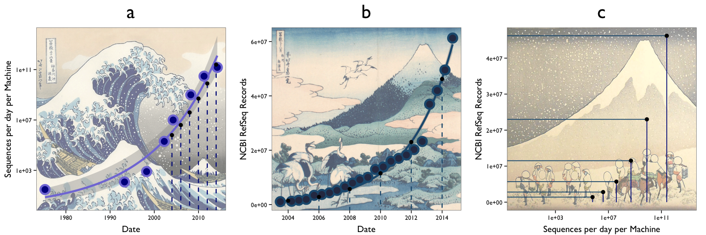

# A veritable tsunami of sequencing
Niels Hanson  
April 8, 2015  

# Preample

* load required libraries


```r
library(ggplot2)
library(png)
library(grid)
```

* we will also need this multiplot function


```r
# Multiple plot function
#
# ggplot objects can be passed in ..., or to plotlist (as a list of ggplot objects)
# - cols:   Number of columns in layout
# - layout: A matrix specifying the layout. If present, 'cols' is ignored.
#
# If the layout is something like matrix(c(1,2,3,3), nrow=2, byrow=TRUE),
# then plot 1 will go in the upper left, 2 will go in the upper right, and
# 3 will go all the way across the bottom.
#
multiplot <- function(..., plotlist=NULL, file, cols=1, layout=NULL) {
  require(grid)
  
  # Make a list from the ... arguments and plotlist
  plots <- c(list(...), plotlist)
  
  numPlots = length(plots)
  
  # If layout is NULL, then use 'cols' to determine layout
  if (is.null(layout)) {
    # Make the panel
    # ncol: Number of columns of plots
    # nrow: Number of rows needed, calculated from # of cols
    layout <- matrix(seq(1, cols * ceiling(numPlots/cols)),
                     ncol = cols, nrow = ceiling(numPlots/cols))
  }
  
  if (numPlots==1) {
    print(plots[[1]])
    
  } else {
    # Set up the page
    grid.newpage()
    pushViewport(viewport(layout = grid.layout(nrow(layout), ncol(layout))))
    
    # Make each plot, in the correct location
    for (i in 1:numPlots) {
      # Get the i,j matrix positions of the regions that contain this subplot
      matchidx <- as.data.frame(which(layout == i, arr.ind = TRUE))
      
      print(plots[[i]], vp = viewport(layout.pos.row = matchidx$row,
                                      layout.pos.col = matchidx$col))
    }
  }
}
```

# Load data


```r
refseq_growth <- read.table("data/refseq_growth.txt", header=T, sep="\t")
refseq_growth$date <- as.Date(refseq_growth$Date, format="%d-%b-%y")

seq_growth <- read.table("data/seq_growth.csv", header=T, sep=",")
seq_growth$date <- as.Date(as.character(seq_growth$date), format="%Y")

Date <- as.Date(c("2004-01-01","2006-01-01","2008-01-01","2010-01-01","2012-01-01","2014-01-01"), format="%Y-%m-%d")
date <- as.Date(c("2004-01-01","2006-01-01","2008-01-01","2010-01-01","2012-01-01","2014-01-01"), format="%Y-%m-%d")
date_df <- data.frame(seq=c(10^5.8, 10^6.6, 10^7.6, 10^8.70, 10^9.9, 10^11.4), 
                      refseq=c(1.4*10^6, 2.8*10^6, 5.7*10^6, 11.5*10^6, 23*10^6, 46.2*10^6),
                      Date)
```

# Create plot

* Prepare the three panels


```r
img <- readPNG("imgs/kanagawa1_faded.png")

p1 <- ggplot(data=seq_growth, aes(x=date, y=kb_day))
p1 <- p1 + annotation_raster(img, -Inf, Inf, -Inf, Inf, interpolate = TRUE)
p1 <- p1 + geom_smooth(method = "glm", family = gaussian(link="log"), size=1.5, color="#827CDA")
p1 <- p1 + geom_point(size=8, color="#827CDA") 
p1 <- p1 + geom_point(size=5, color="#030F8D") 
p1 <- p1 + scale_y_log10() 
p1 <- p1 + theme_bw(base_family="Gill Sans") 
p1 <- p1 + xlab("Date")
p1 <- p1 + ylab("Sequences per day per Machine")
p1 <- p1 + geom_segment(aes(x=Date, y=seq, xend=Date, yend=0), data=date_df, color="#061E8A", linetype=2, size=0.8)
p1 <- p1 + geom_point(data = date_df, aes(x=Date, y=seq), size=3)
p1 <- p1 + ggtitle("a")
p1 <- p1 + theme(plot.title=element_text(size=30, vjust = 2),
                 axis.title.x = element_text(size=14, vjust=-0.3),
                 axis.title.y = element_text(size=14, vjust=1))
#p1

img <- readPNG("imgs/fugi1_faded.png")

p2 <- ggplot(data=refseq_growth[seq(from=1, to=nrow(refseq_growth), by=3),], aes(x=date, y=Records))
p2 <- p2 + annotation_raster(img, -Inf, Inf, -Inf, Inf, interpolate = TRUE)
p2 <- p2 + geom_smooth(method = "glm", family = gaussian(link="log"), size=1.5, color="#205A7E")
p2 <- p2 + geom_point(size=8, color="#205A7E") 
p2 <- p2 + geom_point(size=5, color="#2E3652") 
p2 <- p2 + theme_bw(base_family="Gill Sans") 
p2 <- p2 + xlab("Date")
p2 <- p2 + ylab("NCBI RefSeq Records")
p2 <- p2 + geom_segment(aes(x=Date, y=refseq, xend=Date, yend=-Inf), data=date_df, color="#205A7E", linetype=2, size=0.8)
p2 <- p2 + geom_point(data = date_df, aes(x=Date, y=refseq), size=3)
p2 <- p2 + ggtitle("b")
p2 <- p2 + theme(plot.title=element_text(size=30, vjust = 2),
                 axis.title.x = element_text(size=14, vjust=-0.3),
                 axis.title.y = element_text(size=14, vjust=1))
#p2

img <- readPNG("imgs/winter1_faded.png")

p3 <- ggplot(date_df, aes(seq, refseq))
p3 <- p3 + annotation_raster(img, -Inf, Inf, -Inf, Inf, interpolate = TRUE)
p3 <- p3 + theme_bw(base_family="Gill Sans")
p3 <- p3 + geom_segment(aes(xend=seq, yend=0), color="#061E8A", size=0.6)
p3 <- p3 + geom_segment(aes(xend=0, yend=refseq), color="#205A7E", size=0.6)
p3 <- p3 + geom_point(size=3)
p3 <- p3 + xlab("Sequences per day per Machine")
p3 <- p3 + ylab("NCBI RefSeq Records")
# p3 <- p3 + geom_text(aes(label=format(Date, "%Y"), x=seq, y=refseq), vjust=1.3, hjust=1.2, size=4.5, family="Gill Sans", color="black")
p3 <- p3 + scale_x_log10(limits=c(1,1E13))
p3 <- p3 + ggtitle("c")
p3 <- p3 + theme(plot.title=element_text(size=30, vjust = 2),
                 axis.title.x = element_text(size=14, vjust=-0.3),
                 axis.title.y = element_text(size=14, vjust=1))
multiplot(p1, p2, p3, cols=3)
```

 


